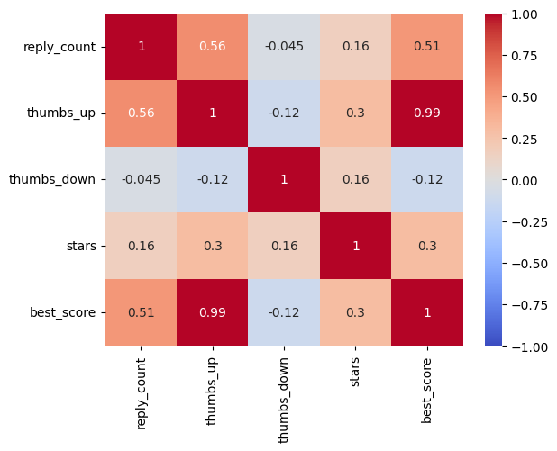
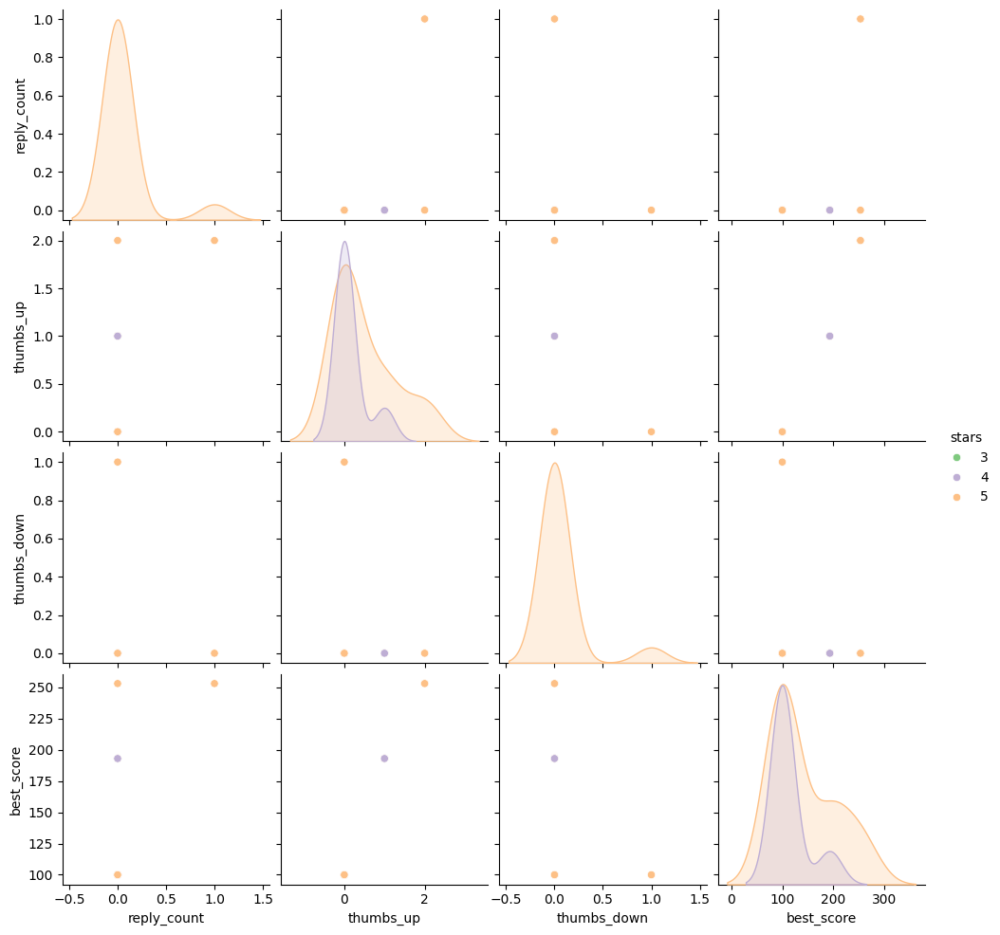
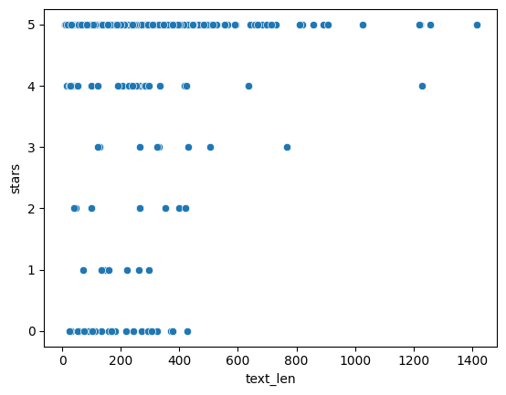

# CSE151A-Project

[Link to notebook](https://colab.research.google.com/drive/1B-XxFEforvRwHhIIadXGSZB1HqIw5l3e?usp=sharing)

---
## Introduction
Through the internet, people from all across the world are able to connect with each other in an instant. This has allowed people from all walks of life to share and receive content, and this explosion of user-generated content has given rise to the importance of an individual's opinion. This can most notably be seen through online shopping. It is extremely rare that someone buys a product without first checking the reviews left by those who have purchased the product. This is because reviews are the lifeblood of a product. Products plagued with bad reviews are an excellent deterrent for others to purchasing those specific products, while products praised with good reviews will most likely bring in more people to buy it since it has been proven to be a good product. This is the foundation for a recommender system or a system that uses an algorithm to recommend users products that they are likely to purchase, and this type of system is important since it brings benefits to both the user and company. For the user, a well built recommender system allows for a user to receive products relevant to them without the effort of having to look through specific products to find the one they need, nor spend too much time sifting through poorly rated products. For the company, a good recommender system can massively improve revenue and keep users on their platform. With this in mind, our group wanted to attempt to make a recommender system, not based on products, but on food recipes.

This project will explore the potential for predicting a user’s rating of a recipe based on textual analysis of comments created by users when reviewing a recipe. We will utilize techniques such as Term Frequency-Inverse Document Frequency, Stochastic Gradient Descent, and Naive Bayes to try to get the most important features of a review’s text and try to produce a model that can transform these features into a prediction. The review data we will be using has been retrieved from the UC Irvine Machine Learning Repository under the title “Recipe Reviews and User Feedback” and contains the necessary features to undergo this task.  

We chose the problem of predicting how a given user will rate a recipe, given their comment because we felt that building such a system for recipes would give insight into the qualities that are both desired or unwanted in specific recipes.

---
## Methods

### Data Exploration:
We explored the data of a single user to see whether any useful information could be extracted from this alone. In other words, we wanted to see if it was possible to predict the rating left by a particular user based on their history of reviews and comment stats. For this selected user, we generated a correlation matrix and a pairplot with the following features: number of replies, number of thumbs up/down, best comment score, and number of stars given.

Next, we explored the possibility of extracting information from a single recipe and the users who reviewed it. We chose one recipe and looked at the distribution of ratings as well as review text length, and explored whether there was a relationship between review length and rating given for that recipe.

  
### Data Preprocessing:
- Missing Values
  - Drop the two missing text entries from the dataset to maintain data consistency.
- Text Tokenization and Cleaning
  - Remove special characters, numbers, and punctuation from the text attribute.
  - Convert all text to lowercase, tokenize the text into individual words, and stored the tokenized text into a list for futher analysis.
- Encoding
  - Encode the categorical attributes, recipe_name and user_name, using one hot encoding for the use in the model. 
- Scaling
  - Scale the numerical attributes, reply_count, thumbs up/down, best_score, and user_reputation, using normalization to ensure range.
- Splitting Data
  - Split the dataset into training and testing sets using an 80:20 ratio to evaluate model performance and avoid overfitting.

### Model One

For our first model we utilized a SGDClassifier, which is a linear classifier that utilizes stochastic gradient descent. This model takes in the td-idf features of the processed text data and outputs a prediction of the stars (rating) category for the given review. In order to deal with the skew in our dataset towards five-star reviews, we utilized SMOTE to oversample our data and give a more uniform sample sapce to operate on. Our first model yielded a 84% accuracy on the training set and a 67% accuracy on the testing set. The combination of a high accuracy on the training set and a significant difference (17%) between the training and testing accuracy indicates that this model is most likely suffering from overfitting. As there are five different outcomes for this classifier (1-5 stars), having a testing accuracy of 67% is well above the random threshold of 20%. 

Based off of our current error rates, we see a low error on the training set and a comparatively higher error on the test set. Based off of the fitting graph, this would indicate we are beyond the ideal range for model complexity and must seek to reduce the complexity of our model to help lessen the gap between the testing and training erorr. Our model is relatively high in complexity as a result of the sheer number of features which are generated by the if-idf values. In the future, we will seek to reduce this aspect of complexity by continuing to increase the granularity of the cleaning of text feature. Through the reduction of false duplicates ('hamburger' vs 'hamberger') and error text ('freerange' vs 'free range') we will reduce the number of tf-idf features and thus create a more generalizable model via the reduction of model complexity. Furthermore, we believe that including some other features such as overall sentiment or review length could also positively impact the accuracy of our model without significantly increasing the overall model complexity.  

In the future, we are considering looking at potentially utilizing a Naive Bayes model such as Sci-Kit Learn's MultinomalNB model. The Naive Bayes model seems ideal as it is able to efficiently handle the volume of data at hand and will effectively utilize the sparse nature of the TF-IDF feature vectors more effectively than the linear regression classifier. Furthermore, we are also interested in looking into utilizing a Random Forest model to see if the leveraging of decision trees would help to aid in more effective classification in the context of having an extreme number of features.   

### Model Two

For our second model, we utilized a Multinomial Naive Bayes classifier, a probabilistic model that is commonly used for text classification tasks. This model was chosen for its suitability in handling sparse data, such as the TF-IDF feature vectors derived from the processed text. To address the issue of class imbalance, we trained the MNB model using the same oversampled dataset employed for the first model. However, we adjusted the parameters of our TF-IDF generation process by limiting the number of words to be considered. This culled out a significant number of words that saw use in <0.1% of the recipe reviews. By new reducing the complexity of our input data, we thus directly reduce the complexity of our model. Initially, the model was trained with the alpha parameter set to 0.01, yielding a training accuracy of 88% and a testing accuracy of 63%. To optimize the model, we conducted a grid search over the hyperparameters `alpha` and `fit_prior`. Retraining the model with the parameters found by grid search—alpha=0.0001 and fit_prior=False—did not affect the training accuracy, but it did bump the testing accuracy up to 64%. Additionally, we performed manual tuning over a larger range of alpha values and did not find a better configuration. By graphing these results, we were able to conclude that 64% was our threshold in regards to hyperparameter tuning.  These results mark a slight decrease in testing accuracy compared to the first model, and the similarly large gap between training and testing performance indicated that overfitting was still an issue.

By reducing model complexity, we aimed to make the model more generalizable; however, the testing error is still high compared to the trainining error, indicating that our second model is also in the overfitting region despite these efforts.

In addition to Random Forest, which was mentioned previously, we may want to consider an XGBoost model. XGBoost is well-suited for handling data with high dimensionality, such as our TF-IDF feature vectors, and is designed to efficiently manage sparse data. It also has the ability to address class imbalance through built-in regularizaion techniques, making it a promising candidate for improving classification performance while potentially mitigating overfitting.  

---
# Results
### Data Exploration  
From exploring a single user:
  - Correlation matrix showing relationship between user-level features and number of stars:
    
    
    - None of these features showed strong correlations to number of stars. The highest were number of thumbs down and best score, both with correlations of 0.3.
      
  - Pairplot of the same features:
    
    
    - Our data for this particular user is too sparse to glean any meaningful information from the pairplot.
   
From exploring a single recipe:
  - Scatterplot showing relationship between review text length and rating for one recipr:
 
    
    
    - From the plot, we found that there exists some correlation between the length of a review's text, and the star rating given, particularly shown between a longer review and a five star rating.
   
### Data Preprocessing

### Model One

### Model Two
   

---
# Discussion
### Data Exploration:
The initial data exploration step largely surrounded getting an idea of the distribution of metrics when compared to overall recipe rating. As we knew that our overall goal for the project was to somehow leverage data in order to provide a rating prediction, our greatest unknown was seeing if there were any preliminary correlations. Through our generation of a correlation plot, we intended to investigate if any of the given quantitative features in the dataset would serve to be good predictors of overall rating. From the correlation plot, we saw that there was very low correlations between these features. This indicated to us that we needed to turn towards review text content in order to generate features or metrics which could be possibly used in order to accurately predict recipe rating. Furthermore, our initial exploration highlighted that our data was extremely skewed towards reviews with a 5/5 rating. This would be important later for our sampling methods when testing models. In order to ensure that our models did not pick up on the skewed data and blindly pick the rating with largest proportion, it was important to utilize oversampling. 

After deciding that it was important to have a strong grasp over the text element of our dataset, we then took a step back and began looking at the connections recipe->users and user->recipes connections. This exploration was done in order to determine the feasability of a recommender system. By understanding the amount of user reviews listed per recipe, recipe reviews done per user, and if there was overlap between these sets, we hoped to be able to potentially similar user rankings in our calculations of rating. Through our exploration, we found that the dataset was not distributed evenly. On one hand there were a fair number of power users who left copious amounts of recipe reviews. On the other hand, the majority of users left one-off reviews. This large disparity within the dataset threw a major wrench in our plan to incorporate a similar user's rating into a prediction for a given review based on a specific reviewer. After this exploration we began to delve deep into the different metrics that we could extract solely from within a single observation's text feature. 

In the exploration of our dataset's text features, we began with the simple metric of the text length of the given review. From a preliminary plot, it appeared that most reviews tended to be roughly around the same length. Although the graph does outwardly depict that reviews with a higher length only yield 5/5 star reviews, we must remember that the vast majority of reviews in the dataset were rated 5/5 stars. Therefore, based off of this skew in data, it is not fair to generalize preliminarily that review length has a strong correlation to review rating. Perchance in the future it would have been a worthwhile exercise to randomly sample even numbers of reviews and then compare the yielded text lengths to get a more fair comparison. 

Since the utilization of review length on its own did not seem like the most promising feature to utilize, we began exploring more advanced metrics! The one we settled on was TF-IDF (term frequency - inverse document frequency). TF-IDF utilizes both the frequency of a word within a review text and the frequency of said word across the entire corupus of reviews. We believed that this metric would be invaluable in the pursuit of predicting a review rating as we thought could help to uncover words with strong connotations. More specifically, we wanted to see if there were words that were outside of the regular "bad", "incredible", "delicious', etc. that could be utilized as markers for a reviews overall rating. In the end, we determined that utilizing TF-IDF was the best course of action in terms of getting a metric to feed into a model. Our goal was to utilize the generation of TF-IDF values and then attempt to incorporate more features if necessary. The largest obstacle in terms of generating these features was that it was highly dependent on our data being extremely clean. This small tidbit led to an extremely large and time-consuming cleaning process.

### Data Preprocessing:
After our selection of TF-IDF as our primary feature to be utilized in our models, we embarked on the process of cleaning the text feature so it could accurately generate word frequencies. The removal of punctuation and capitalization was straightforward. The real problem came in duplicate words and misspellings. For example, "broccoli" would be incorrectly counted differently than the presence of "brocoli" based off of our process for generating the TF-IDF values. This meant we had to find a way to spell-check our dataset. We attempted to utilize the spellchecker and fuzzywuzzy python libraries to help expedite this process. Unfortunately for us, the spellchecker only did so well and still left a daunting amount of data which needed to be manually cleaned. We performed this manual cleaning on the data by either entering a word into corrections dictionary or adding it to a to-be-cleaned list. This process, although not difficult, was extremely time consuming. Furthermore, looking back it appeared that some of these typos or one-off words seemed to only occur a singular time in the dataset. If we could redo this section of the project, it would have been a good idea to weigh the benefit or drawback of meing as meticulous with our cleaning as we were. Furthermore, the granularity of our cleaning was made slightly less important once we began experimenting with the hyperparamters of the TF-IDF Vectorizer which generated our TF-IDF values. By limiting the number of features or only selecting words which were in X% of the corpus documents, we were able to cull some of the more obscure or unclean words from the dataset. Although we do agree that our cleaning of the data was a necessary step, we think that we could have been a bit more effective in terms of how we completed it and the granularity of our cleaning. 

## Model One

## Model Two
The second model that we utilized in our pursuits was a Multinomial Naive Bayes classifier. We selected this model because Naive Bayes classifiers tend to perform extremely well when given text input. Even more specifically, Naive Bayes classifiers tend to be extremely receptive to TF-IDF values. Therefore, we thought it was a logical next step when it came to selecting another model to apply to our dataset. When given the same inputs as our SGD Classifier, the Naive Bayes model appeared to perform worse than the SGD Classifier. This logically makes sense, as one of the conclusions we reached when evaluating our SGD Classifier was that we needed to simplify our model. From a purely objective standpoint, the SGD Classifier is simpler than a Multinomial Naive Bayes. Looking back, we made the decision to utilize a Multinomial Naives Model before we reevaluated our generation of TF-IDF values. After significantly simplifying the complexity of our input vector through the utilizing of limiting features, we heavily simplified our model outright. Therefore, it makes sense that this simplification increased the efficacy of our first model versus our follow-up. Looking back, it would have been a good idea to first reduce the model complexity via input feature reduction, then evaluate our first model on the fitting graph, and then finally move forward when looking at whether to add or remove complexity from our process. Despite choosing the MNB Classifier model without following this process, we still believe that it was a worthwhile model to test as Naive Bayes works well with text feature data and is also a relatively simple machine learning model. Through our utilization of this model, we did find some levels of success. The second model saw similar, albeit slightly worse, results to our first model. Even with the utilization of a hyperparameter search, we were unable to generate a MNB Classifier that performed better than the SGD Classifier. Perchance, we could have tried utilizing a broader range of hyperparameters and values for said hyperparameters. Despite all the above, it was extremely evident that our model was still tending to overfit our input data. With such a significant disparity between the training and test accuracies, the model fitting graph still suggests that we must simplify the model even further! 

### - Future Models 

---
# Conclusion
## Model One
Overall, our first model served as a good launch point for our investigation of this dataset. The SGDClassifier yielded a relatively low training error and a *comparatively* higher testing error! This indicates that there is significant room to grow in terms of changing our features and underlying model in order to venture closer to the ideal level of model complexity which would yield a more generalizable model. Based off of these error rates, we can conclude that utilization of the TF-IDF of words yields a better prediction than randomly selecting a rating; however, there is still significant room to improve and increase the model's overall efficacy. More specifically, we believe that the model could be improved by cleaning the text data even more thoroughly to help increase the accuracy of the TF-IDF values. This would help to reduce the complexity of our model by decreasing the number of features we are inputting. Furthermore, we are seeking to explore the inclusion of other attributes of the text as features in our model. Whether this surrounds something simple, such as review length, or something more complicated, such as sentiment, we hope that pulling more information from the review text column will help to improve our model!   

## Model Two   
Our second model, the Multinomial Naive Bayes classifier, demonstrated a slightly decreased performance compared to the SGDClassifier, with a testing accuracy of 64% vs. 67%. Additionally, the large gap between training and testing accuracies (24%) persists, indicating that overfitting remains a key challenge despite taking steps to reduce feature dimensionality. The hyperparameter tuning we performed confirmed that we has found the configuration that yielded the best performance, suggesting that further improvements will not come from additional tuning. Instead, some options to improve performance include employing more robust cross validation techniques (eg. k-fold) to help prevent overfitting to the training data, exploring other types of regularization techniques, and possibly exploring other methods for addressing class imbalance.  

---
# Statement of Collaboration
- David Yonemura: Coder: Coded the exploratory data analysis, only on the entire dataset and not on the specific users and recipes. Also coded the text clean up, TF-IDF, oversampling, and SGDClassifier code.
- Jared Jose: Coding: Generated links between users/recipes for possible recommender system, aided in speed-up snippets of data cleaning, TF-IDF generation (optimization), oversampling, MNB Classifier code. Wrote write-up for Milestone 3. 
